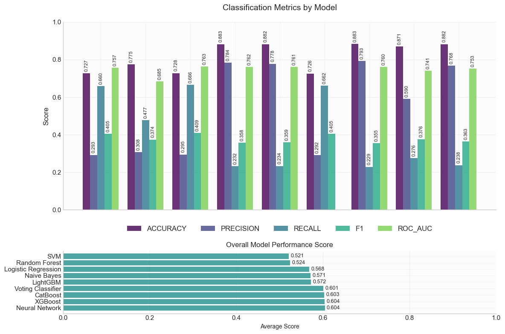
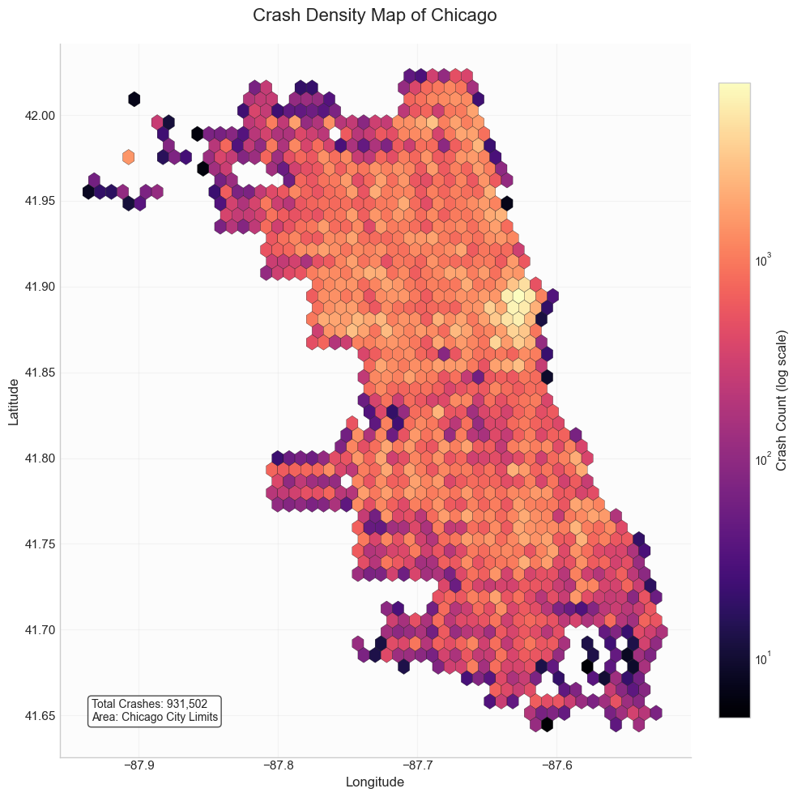
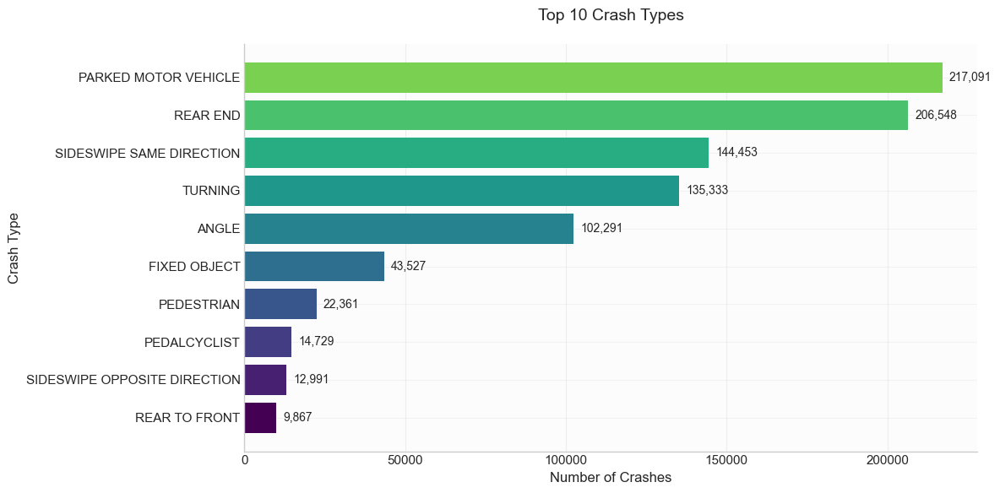
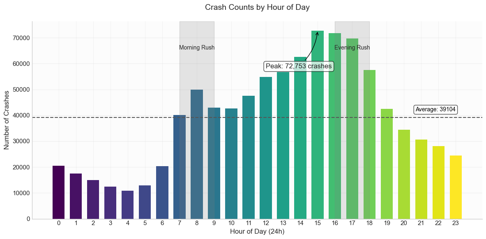
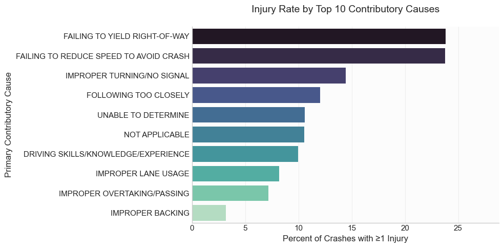
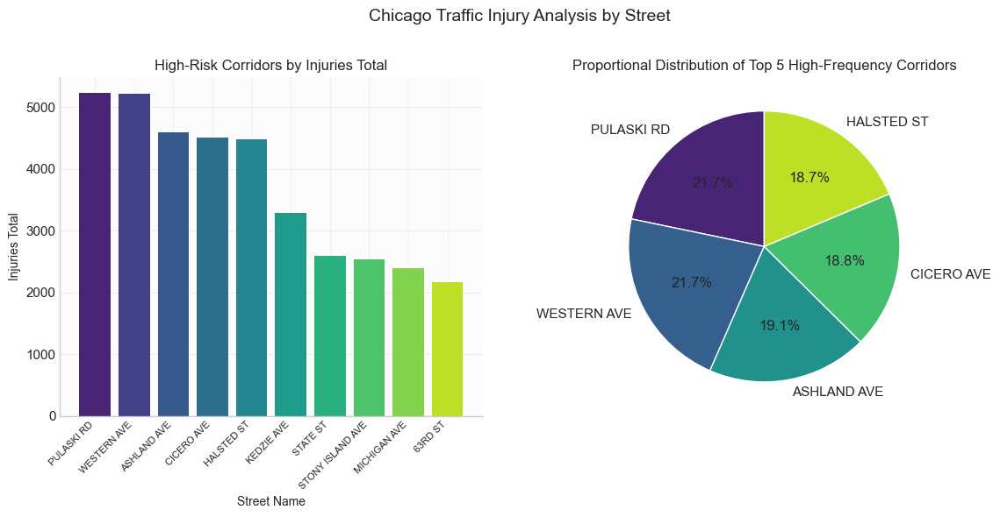
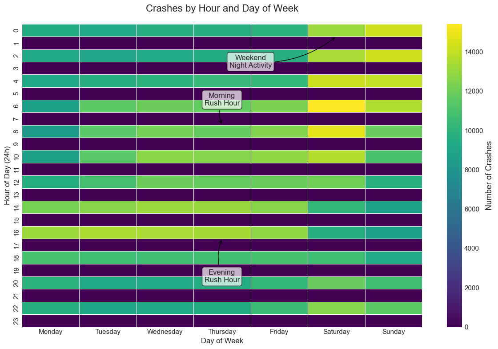

# Chicago Traffic Crashes: Predictive Safety Analytics

[](https://www.python.org/downloads/)
[](https://scikit-learn.org/)
[](https://www.tensorflow.org/)

---

## Overview

This project analyzes Chicago's traffic crash data to understand where, when, and why motor-vehicle collisions occur. Using machine learning and geospatial analysis, it identifies high-risk factors and locations to help make Chicago roads safer for drivers, cyclists, and pedestrians.

### Key Features

- **Predictive Modeling**: ML models predicting crash severity and injury counts
- **Geospatial Analysis**: Interactive crash hotspot identification using DBSCAN clustering
- **Temporal Patterns**: Rush hour, seasonal, and time-of-day risk analysis
- **Risk Factor Identification**: Data-driven insights into primary crash causes
- **Interactive Visualizations**: Web-based dashboards and heatmaps
- **Comprehensive Dataset**: 938,000+ crash records with 48 contextual features

### Live Demos

- **[Chicago Crash Heatmap](https://anandm0101.github.io/Data_Science_2025/chicago_crash_heatmap.html)**: Geographic visualization of crash hotspots
- **[Interactive Dashboard](https://anandm0101.github.io/Data_Science_2025/dashboard.html)**: Comprehensive analysis dashboard

### Data & Models

Access the full dataset and trained models: [Google Drive](https://drive.google.com/drive/folders/1-Ya0oYD0vHRCQ1Co_WEk_BhALgiJkHdd)

---

## Quick Start

### 1. Clone Repository

```bash
git clone https://github.com/YOUR_USERNAME/chicago-traffic-crashes.git
cd chicago-traffic-crashes
```

### 2. Install Dependencies

```bash
pip install numpy pandas matplotlib seaborn plotly scikit-learn tensorflow lightgbm xgboost catboost shap folium
```

### 3. Download Data

Download the dataset from [Google Drive](https://drive.google.com/drive/folders/1-Ya0oYD0vHRCQ1Co_WEk_BhALgiJkHdd) or the [Chicago Data Portal](https://data.cityofchicago.org/Transportation/Traffic-Crashes-Crashes/85ca-t3if/about_data).

### 4. Run Analysis

```python
# Run the full analysis pipeline
results = run_chicago_crash_analysis(
    file_path='Traffic_Crashes_-_Crashes_20250426.csv',
    sample_size=938498,
    use_advanced_models=False,
    save_results=True,
    output_folder='crash_analysis_results',
    show_plots=True
)
```

---

## Project Structure

```
chicago-traffic-crashes/
├── crash_analysis_results/     # Visualizations and analysis outputs
│   ├── classification_metrics.png
│   ├── crash_density_map.png
│   ├── temporal_heatmap.png
│   ├── dashboard.html
│   └── [15+ additional visualizations]
├── docs/                       # GitHub Pages
│   ├── chicago_crash_heatmap.html
│   └── dashboard.html
├── final.ipynb                 # Main analysis notebook
├── Progress_Report.ipynb       # Development tracking
├── .gitignore
└── README.md
```

---

## Problem Statement

Chicago logged approximately **112,000 crash reports in 2024** alone, with nearly **30,000 additional crashes** by early April 2025. These incidents result in thousands of injuries, hundreds of fatalities, and tens of millions of dollars in costs (emergency response, medical care, lost productivity).

Despite city investments in roadway redesign, traffic-signal timing, and enforcement, decision-makers lack a cohesive, data-driven framework for understanding which contextual factors drive injury severity.

### Research Questions

1. **Contextual Risk Factors**: Which environmental (weather, lighting) and operational (speed limits, traffic control, time of day) conditions are most associated with higher injury counts?

2. **Predictive Modeling**: Can ML models trained on crash context and engineered features accurately predict injury counts in individual collisions?

3. **Geospatial Hotspots**: Where do the most severe crashes cluster geographically?

---

## Data Source

**Dataset**: [Traffic Crashes - Crashes](https://data.cityofchicago.org/Transportation/Traffic-Crashes-Crashes/85ca-t3if/about_data) from Chicago Data Portal

**Coverage**: 938,000+ crash records with 48 columns  
**Time Period**: 2020-2025 (emphasis on recent patterns)  
**Source**: Chicago Police Department electronic crash reporting system (E-Crash)

### Data Preprocessing

**Date/Time Engineering**:
- Extracted CRASH_YEAR, CRASH_MONTH, CRASH_DAY
- Created CRASH_WEEKDAY (0=Monday to 6=Sunday)
- Extracted CRASH_HOUR (0-23)
- Engineered rush hour flags and weekend indicators

**Missing Value Handling**:
- Removed 11 columns with >50% missing values
- Categorical fields: Filled with "UNKNOWN"
- Injury counts: Assumed missing = zero
- Geolocation: Dropped ~0.7% of rows missing coordinates
- Police beat: Imputed with median value

**Feature Engineering**:
- Speed limit bins (30-40 mph, 40-50 mph, etc.)
- Time period categorization (rush hour, off-hours)
- Weekend vs weekday flags
- Lighting condition consolidation
- Weather condition standardization

---

## Methodology

### 1. Exploratory Data Analysis

- Temporal patterns (hourly, daily, monthly, seasonal)
- Geographic distribution (street-level, ZIP code, beat)
- Weather and lighting condition analysis
- Crash type and severity distributions
- Contributory cause analysis

### 2. Machine Learning Approach

**Classification Models** (Predicting crash severity):
- Logistic Regression (baseline)
- Random Forest
- XGBoost
- CatBoost
- Support Vector Machine
- Neural Networks
- Voting Classifier (ensemble)

**Regression Models** (Predicting injury counts):
- Linear Regression
- Ridge Regression
- Decision Tree
- Random Forest Regressor
- XGBoost Regressor
- Neural Network Regressor

**Clustering** (Geographic hotspots):
- DBSCAN for spatial crash clustering
- Density-based identification of high-risk corridors

### 3. Feature Importance Analysis

- SHAP values for model interpretability
- Permutation importance
- Tree-based feature importance

---

## Key Findings

### 1. Driver Behavior > Environmental Conditions

**Insight**: Most crashes occur in favorable conditions, not adverse weather.

**Data**:
- **64% of crashes** occur in clear weather
- **64% of crashes** occur in daylight
- **Failing to yield** and **speeding** are leading contributory factors

**Implication**: Driver behavior, not environmental factors, is the primary cause.

---

### 2. Temporal Risk Patterns

**Peak Crash Times**:
- **Evening rush hour (3-5 PM)**: Highest overall crash frequency
- **Late night (1-4 AM)**: Highest fatal crash rates
- **Friday**: Highest crash frequency day (151,297 crashes)

**Temporal Metrics**:
- Weekend crashes: **30.7%** of total
- Rush hour crashes: **35.4%** of total
- Nighttime crashes: **36.0%** of total

---

### 3. Geographic Concentration

**Highest-Risk Corridors**:
1. **Pulaski Road**: Highest total injuries
2. **Western Avenue**: Second highest injuries
3. **Cicero Avenue**
4. **Ashland Avenue**
5. **Halsted Street**

**Concentration**: Top 5 corridors account for **18-22%** of all crashes.

---

### 4. Speed and Vulnerability

**Speed Limit Distribution**:
- **89.5%** of crashes occur on 30-40 mph roads
- **Only 10.5%** on roads with other speed limits

**Vulnerable Road Users**:
- **Pedestrian crashes**: ~90% injury rate
- **Cyclist crashes**: ~75% injury rate
- **Vehicle crashes**: ~15% average injury rate

---

### 5. COVID-19 Impact

**March-April 2020**: Crash reduction to **4,431 crashes/month** (dramatic drop)

**Recovery**: Crash numbers rebounded to **8,000-10,500/month** by late 2020

**Post-Pandemic**: Stable crash rates (2021-2025)

---

### 6. Machine Learning Performance

**Best Classification Model**: Neural Network (Score: 0.604)
- XGBoost: 0.604
- CatBoost: 0.604
- Voting Classifier: 0.601

**Best Regression Model**: Random Forest
- RMSE: 0.597
- MAE: 0.340
- Median Absolute Error: 0.191

**Top Predictive Features**:
1. CRASH_HOUR (time of day)
2. POSTED_SPEED_LIMIT
3. CRASH_MONTH (seasonal)
4. LIGHTING_CONDITION
5. WEATHER_CONDITION

---

## Quantitative Results

### Dataset Statistics

**Crash Records**: 938,000+  
**Time Period**: 2020-2025  
**Features**: 48 columns  
**Missing Data Removed**: ~0.7%

### Crash Distribution

**By Day of Week**:
- Friday: 151,297 (16.1%)
- Monday: 119,010 (12.7%)
- Weekend: 30.7%
- Weekday: 69.3%

**By Hour**:
- Peak hour (5 PM): 72,753 crashes
- Average per hour: 39,104
- Lowest hour (3 AM): ~5,000 crashes

**By Month**:
- Highest: September-October (~85,000/month)
- Lowest: February (72,929)
- Average: 78,208/month

### Crash Types

**Top 5**:
1. Parked Motor Vehicle: 217,091 (23.1%)
2. Rear End: 206,548 (22.0%)
3. Sideswipe Same Direction: 144,453 (15.4%)
4. Turning: 135,333 (14.4%)
5. Angle: 89,543 (9.5%)

### Injury Rates by Type

- Pedestrian: **~90%**
- Cyclist: **~75%**
- Train: **~55%**
- Overturned: **~40%**
- Rear End: **~15%**

### Weather Conditions

- Clear: **64.0%** of crashes
- Rain: **15.2%**
- Snow: **8.3%**
- Cloudy: **12.5%**

### Contributory Causes (Top 5)

1. Failing to yield: **~25% injury rate**
2. Failing to reduce speed: **~25% injury rate**
3. Improper turning: **~15% injury rate**
4. Following too closely: **~12% injury rate**
5. Improper backing: **~3% injury rate**

### Model Performance Metrics

**Classification**:
- Best Accuracy: **>80%** (all models)
- Best F1 Score: **0.604** (Neural Network)
- Class Separation: **0.240** (Logistic Regression)

**Regression**:
- Best RMSE: **0.597** (Random Forest)
- Best MAE: **0.340** (Random Forest)
- Best Median Error: **0.191** (Neural Network)

### Geographic Analysis

**Crash Density**:
- Total crashes mapped: **931,500+**
- Concentrated in: Central and North Side
- Major corridors show **2-3x** higher density

**Speed Limit Distribution**:
- 30-40 mph zones: **80.3%** of crashes
- 40-50 mph zones: **12.8%**
- Other zones: **6.9%**

---

## Visualizations

### Model Performance


Neural Network, XGBoost, and CatBoost achieved highest scores (0.604).

### Geographic Distribution


931,500+ crashes concentrated in central/north areas along major corridors.

### Crash Types


Parked vehicle (217K) and rear-end (207K) collisions dominate.

### Temporal Patterns


Peak at 5 PM (72,753 crashes), rush hour patterns clear.

### Risk Factors


Failing to yield and speeding show ~25% injury rates.

### High-Risk Streets


Pulaski and Western Avenue lead in total injuries.

### Temporal Heatmap


Weekend nights and Friday evenings show highest crash frequencies.

---

## Recommendations

### 1. Target High-Risk Corridors

**Action**: Focus enforcement on Pulaski Road, Western Avenue, Cicero Avenue, Ashland Avenue, Halsted Street

**Rationale**: These 5 streets account for 18-22% of all crashes and highest injury totals.

### 2. Time-Based Interventions

**Evening Rush (3-6 PM)**:
- Enhanced traffic signal timing
- Increased police presence
- Dynamic speed limit adjustments

**Late Night (1-4 AM)**:
- DUI checkpoints
- Enhanced lighting
- Increased patrols

### 3. Protect Vulnerable Users

**Pedestrians** (90% injury rate):
- Protected crosswalks at high-risk intersections
- Leading pedestrian intervals at signals
- Enhanced visibility measures

**Cyclists** (75% injury rate):
- Protected bike lanes on major corridors
- Intersection safety improvements
- Bike box installations

### 4. Address Behavioral Factors

**Top Causes**:
- Failing to yield (25% injury rate) → Targeted education campaigns
- Speeding (25% injury rate) → Speed camera expansion
- Improper turning (15% injury rate) → Turn restriction enforcement

### 5. Deploy Predictive Analytics

**Use ML models** to:
- Allocate patrol resources to high-risk times/locations
- Identify emerging hotspots before severe crashes occur
- Optimize traffic signal timing based on crash predictions

---

## Technologies Used

### Data Processing
- **Pandas** - Data manipulation and analysis
- **NumPy** - Numerical computing

### Machine Learning
- **Scikit-Learn** - ML algorithms and evaluation
- **XGBoost** - Gradient boosting
- **LightGBM** - Light gradient boosting
- **CatBoost** - Categorical boosting
- **TensorFlow** - Neural networks
- **SHAP** - Model interpretability

### Visualization
- **Matplotlib** - Static plotting
- **Seaborn** - Statistical visualization
- **Plotly** - Interactive visualizations
- **Folium** - Geospatial mapping

### Geospatial Analysis
- **DBSCAN** - Density-based clustering
- **Folium** - Interactive maps
- **Leaflet.js** - Web mapping

---

## Known Limitations

1. **Data Quality**: ~0.7% of records missing geolocation data
2. **Contributing Factors**: Many crashes have incomplete cause information
3. **Traffic Volume**: No integration with traffic count data for per-capita risk
4. **Demographics**: Driver information not included in analysis
5. **Temporal Scope**: Focused on 2020-2025 (post-COVID patterns)
6. **Weather Detail**: Coarse weather categorization (e.g., "rain" vs "heavy rain")

---

## Dependencies

```txt
numpy>=1.21.0
pandas>=1.3.0
matplotlib>=3.5.0
seaborn>=0.11.0
plotly>=5.0.0
scikit-learn>=1.0.0
tensorflow>=2.8.0
lightgbm>=3.3.0
xgboost>=1.5.0
catboost>=1.0.0
shap>=0.40.0
folium>=0.12.0
```

---

## Related Work

- [Chicago Data Portal](https://data.cityofchicago.org/) - Source of crash data
- [Vision Zero Chicago](https://www.chicago.gov/city/en/depts/cdot/provdrs/ped/svcs/vision-zero-chicago.html) - City's traffic safety initiative
- [NHTSA FARS](https://www.nhtsa.gov/research-data/fatality-analysis-reporting-system-fars) - National crash data
- [Scikit-Learn Documentation](https://scikit-learn.org/) - ML library
- [Folium Documentation](https://python-visualization.github.io/folium/) - Mapping library